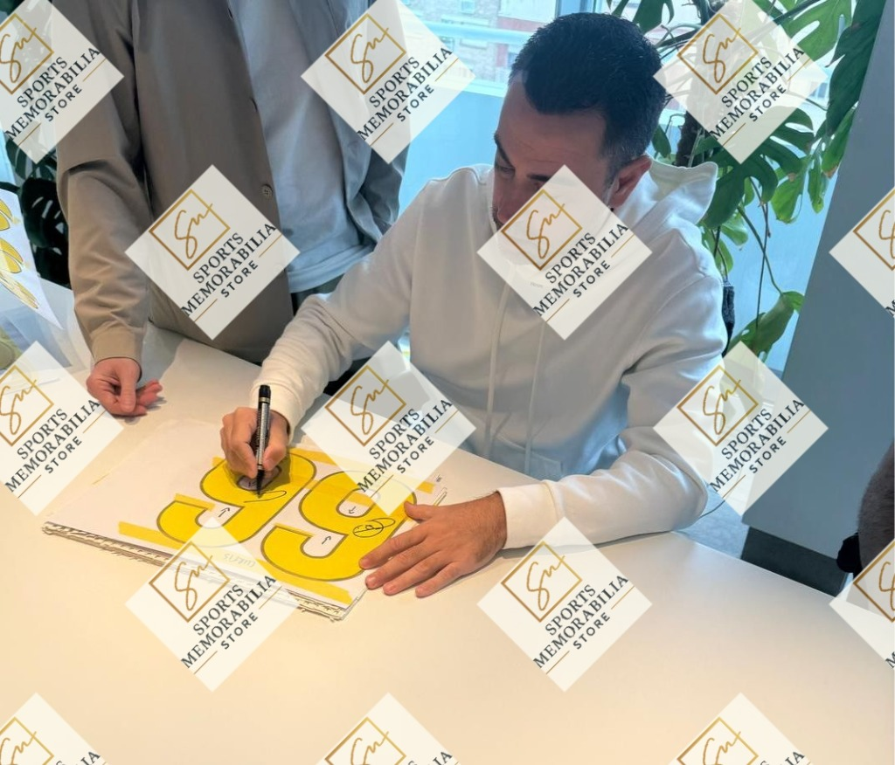
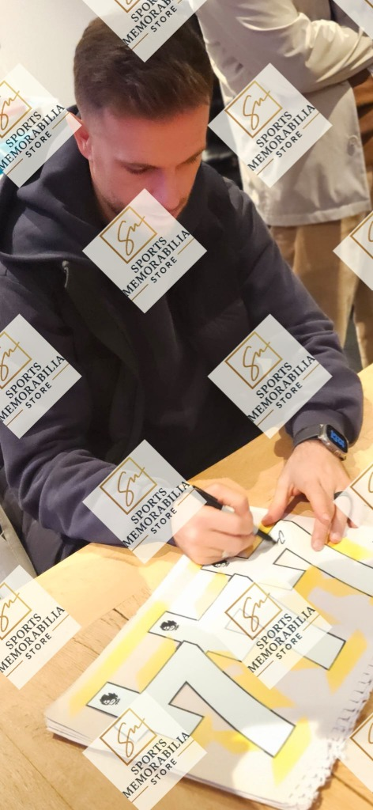
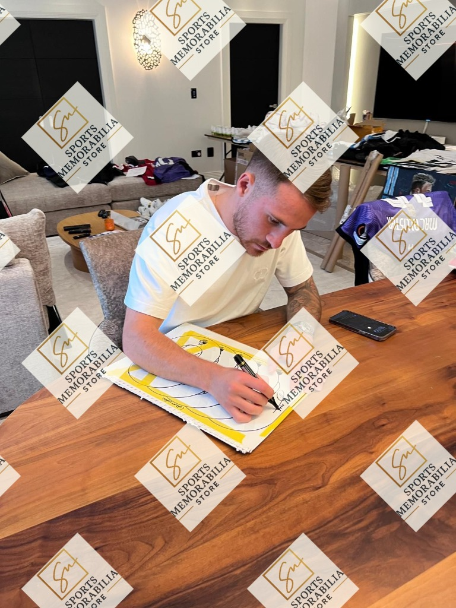
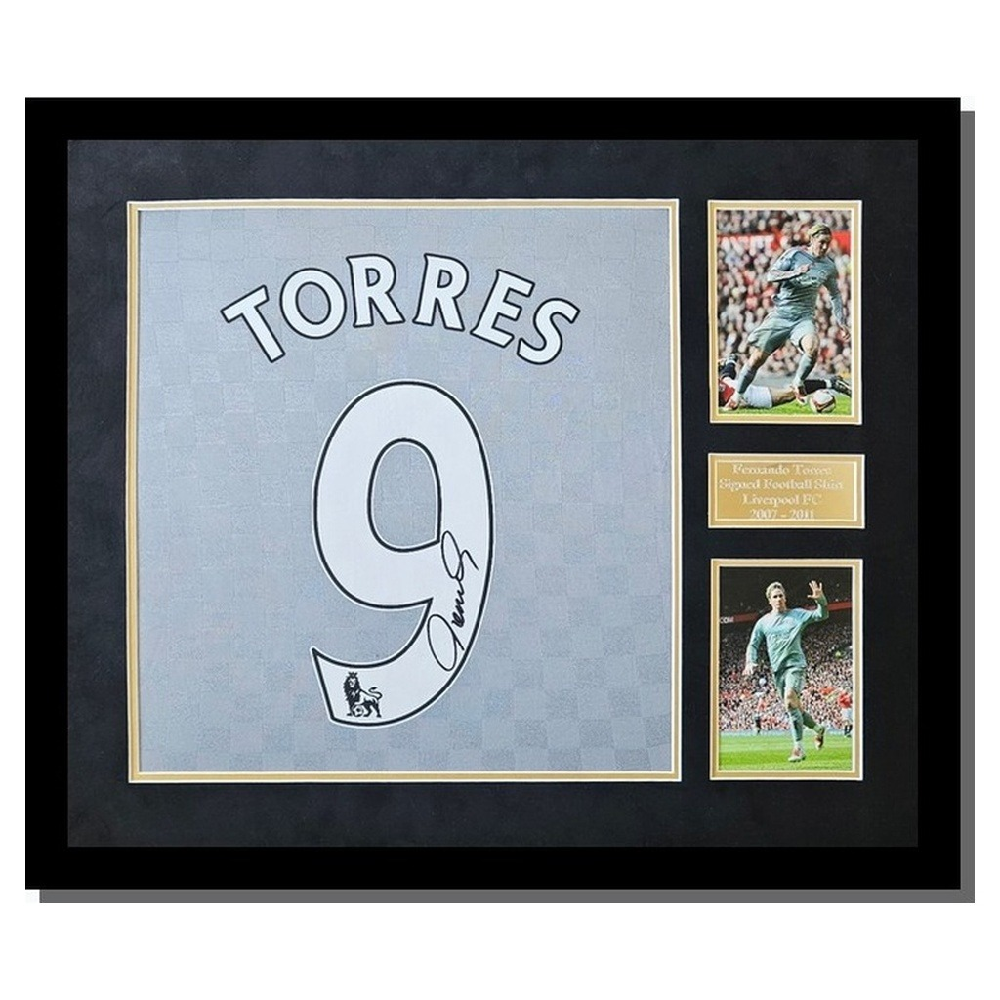
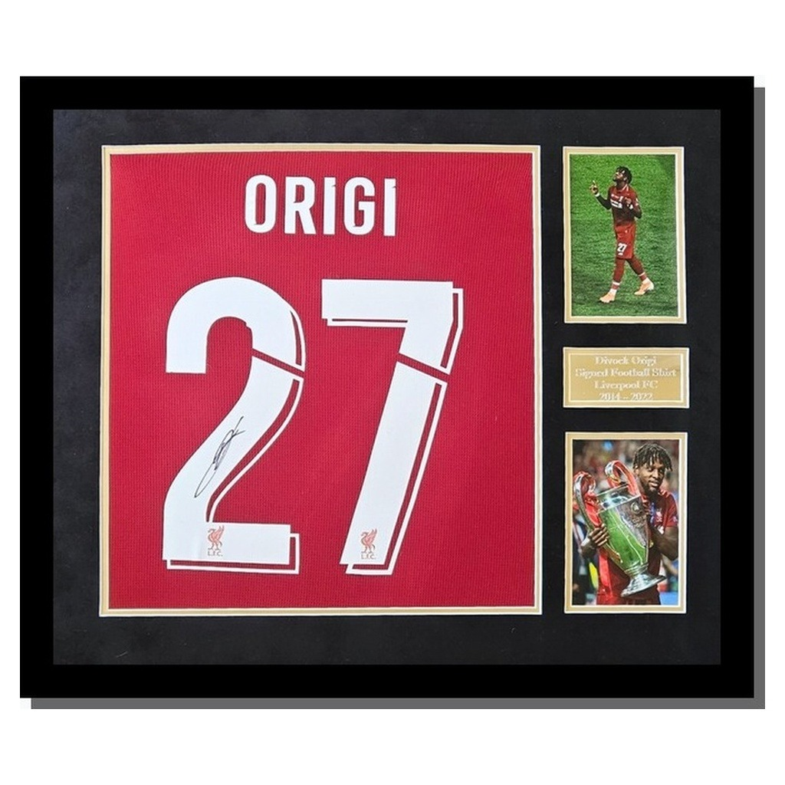

# Sports Signed - Product Guide

This guide outlines our core products, framing standards, and authenticity guarantees for corporate and private clients.

## The Products

We specialise in fully authenticated, signed sports memorabilia. All items are professionally framed and delivered in premium packaging.

### Framing Standards
* **Frames:** Solid black wooden frames.
* **Mounting:** Clean white mounts to protect the shirt and provide a gallery finish.
* **Plaques:** Custom metallic plaques detailing the player and era.

### Presentation
Every framed shirt is delivered in a matte black lid box with gold foil branding. The internal lining ensures the frame arrives in perfect condition.

## The Roster

We provide signed items from top-tier athletes, including:
* Alexis Mac Allister (Liverpool FC / Argentina)
* Cody Gakpo (Liverpool FC / Netherlands)
* Fernando Torres (Liverpool Legend)
* Divock Origi (Champions League Winner)
* Steven Gerrard (Liverpool Legend)

## Authenticity & Proof of Signing

All items are signed in the presence of our team. Our founder is a licensed FIFA agent, allowing us direct access to players at their homes or training grounds. We do not use third-party brokers. Every frame includes an embedded NFC chip that links to a digital Certificate of Authenticity.

### Signing Sessions

Below is photographic proof of our recent signing sessions with current athletes:

### Finished Products

## Corporate Use Cases

Our items are regularly purchased by businesses for:

* **Employee Recognition:**
  "We gave a signed Mac Allister shirt to our top salesperson this year. The reaction was brilliant, and it sits proudly in his home office." – *Sales Director, London*

* **Charity Auctions:**
  "The Origi framed shirt was the highlight of our annual charity dinner. Having the photos of him signing it really helped push the bids up." – *Event Organiser, Manchester*

* **Office Aesthetics:**
  "We've bought three framed shirts for our new boardrooms. They look fantastic and are a great talking point for clients." – *Managing Director, Leeds*
